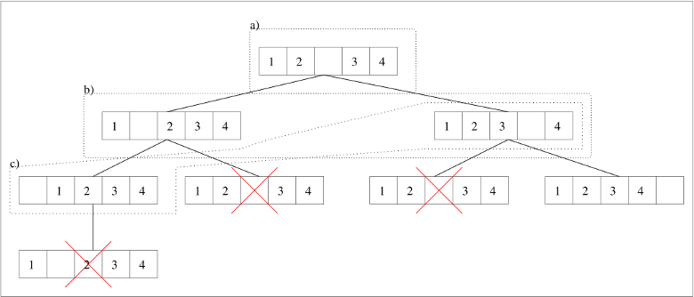

#  Bases de la programmation orientée objet 

### IUT Montpellier-Sète – Département Informatique

* **Cours:** [M2103](http://cache.media.enseignementsup-recherche.gouv.fr/file/25/09/7/PPN_INFORMATIQUE_256097.pdf) - support [ici](https://github.com/IUTInfoMontp-M2103/Ressources)
* **Enseignants:** [Marin Bougeret](mailto:marin.bougeret@umontpellier.fr), [Sébastien Gagné](mailto:sebastien.gagne@umontpellier.fr), [Sophie Nabitz](mailto:sophie.nabitz@univ-avignon.fr), [Jérôme Palaysi](mailto:jerome.palaysi@umontpellier.fr), [Victor Poupet](mailto:victor.poupet@umontpellier.fr), [Petru Valicov](mailto:petru.valicov@umontpellier.fr)
* Le [forum Piazza](https://piazza.com/class/k52c8w685w3210) de ce cours pour poser vos questions
* [Email](mailto:petru.valicov@umontpellier.fr) pour une question d'ordre privée concernant le cours.
* Le [sujet du TP](https://pageperso.lis-lab.fr/~petru.valicov/Cours/M2103/TP6.pdf) en format .pdf téléchargeable et imprimable.

Avant de démarrer le TP, vérifiez que vous n'avez pas atteint votre quota d'espace de stockage autorisé :

* placez-vous dans votre `$HOME` et utilisez les commandes suivantes :
    * `du -sh` pour voir combien d'espace vous avez déjà utilisé
    * `du -sh *` pour voir combien d'espace vous avez déjà utilisé pour chaque fichier (sans fichiers cachés)
    * `du -sch .[!.]* *` pour voir combien d'espace vous avez déjà utilisé pour chaque fichier, y compris les fichiers cachés
* Supprimez les fichiers inutiles.
* Pour éviter des problèmes durant vos TPs d'informatique, vous devriez toujours **garder 300-400 Mo d'espace libre**.


### Consignes
- Vous respecterez toutes les [consignes](https://github.com/IUTInfoMontp-M2103/TP4#consignes) indiquées dans le TP4.
- Vous essaierez de respecter au maximum les [consignes](https://github.com/IUTInfoMontp-M2103/TP5#consignes) indiquées dans le TP5.
- Des commentaires sont données dans le code qui vous est fourni afin de vous aider à comprendre ce que vous êtes censés de programmer.


## TP6
#### _Thème : Héritage, Interfaces_

Cliquez sur le lien ci-dessous pour faire votre fork privé du TP (**attention, pas de fork à la main !**):

https://classroom.github.com/a/lb4ilznk

Date limite de rendu de votre code sur le dépôt GitHub : **Dimanche 15 mars à 23h00**

L’objectif de ce TP est d’écrire un algorithme qui résout par exploration totale n’importe quel "puzzle". Avant de commencer le travail, nous allons
illustrer cet algorithme sur un puzzle très simple : un [taquin](https://fr.wikipedia.org/wiki/Taquin) en une dimension.
Puis, vous implémenterez dans la [Partie 1](https://github.com/IUTInfoMontp-M2103/TP6#partie-1) cet algorithme sur un taquin **en deux dimensions**.
Enfin, vous généraliserez cet algorithme à n’importe quel puzzle dans la [Partie 2](https://github.com/IUTInfoMontp-M2103/TP6#partie-2).

Prenons l’exemple d’un taquin en une dimension à 5 cases. La position initiale (notée `1 2 * 3 4` ) du taquin est
dessinée en haut de la figure ci-dessous :



**Figure 1 :** Arbre d'exploration des solutions d'une configuration de taquin à une dimension


Le trou se trouve au milieu, avec les palets 1 et 2 à gauche, et 3 et 4 à droite. On considère que la position
gagnante est `1 2 3 4 *`.
Nous allons décrire informellement l’algorithme pour résoudre le taquin. Cet algorithme utilise deux variables :
* __frontiere__ : qui va contenir à chaque instant un ensemble de configurations de taquin différentes qu’il reste à
examiner
* __dejaVues__ : qui va contenir à chaque instant l’ensemble des configurations déjà examinées.

On initialise `frontiere` et `dejaVues` avec la configuration initiale, et on maintiendra l'invariant que `frontiere`
est un sous-ensemble de `dejaVues`.  À chaque étape, on extrait une configuration de la frontière, on en génère toutes
les configurations "filles" c’est-à-dire les configurations atteignables en effectuant _un seul mouvement valide_, puis
on ajoute à  `frontiere` et à `dejaVues`  toutes les configurations filles qui n’ont pas été déjà vues. Les ensembles de
configurations _a)_, _b)_ et _c)_, délimités en pointillés, indiquent l’évolution de la frontière lors des 3 premières
étapes (en supposant que lorsque la frontière était égale à _b)_, c'est la configuration `1 * 2 3 4` qui a été extraite).
Remarquez que les configurations barrées ne sont pas ajoutées à la `frontiere` (ni à `dejaVues`) puisqu’elles sont déjà
présentes dans `dejaVues` au moment où l'on essaye de les ajouter. L’algorithme se termine lorsqu’il atteint une
configuration gagnante, ou lorsque la frontière devient vide. Ainsi on obtient une structure arborescente (ou arbre
d'exploration) représentant l'ensemble de mouvements valides obtenus à partir de la racine (configuration initiale). 

**Remarque** : Certaines configurations du taquin ne sont pas résolubles. En une dimension il est facile de voir que les
cases ne peuvent pas se croiser (donc par exemple la configuration `2 1 * 3 4` ne peut pas être résolue) et en deux
dimensions on peut montrer que la moitié des configurations initiales possibles n'admettent pas de solution (cf.
[page _Wikipédia_](https://fr.wikipedia.org/wiki/Taquin#Configurations_solubles_et_insolubles) pour une caractérisation).
 
L'algorithme expliqué ci-dessus, permet de résoudre le taquin, à savoir obtenir la configuration finale gagnante si elle
existe. Dans ce qui suit, on vous demandera également de stocker la _trace_ de la solution, qui indique les configurations
obtenues à chaque étape intermédiaire pour arriver à la solution finale. Avoir la trace est intéressant pour
un utilisateur, afin de voir la stratégie à adopter pour résoudre le puzzle à partir de la configuration initiale. C'est aussi pratique pour vérifier si votre programme fonctionne correctement... La trace de la solution va correspondre à une liste chaînée de configurations construite de la façon suivante : lorsqu’une configuration `c2` est générée à partir d’une configuration `c1`, on mémorisera que
le "_père_" de `c2` est `c1`. Un maillon de cette liste chaînée est donc un couple (_configuration taquin, couple parent_).

Dans tout le TP, nous vous invitons à vérifier au fur et à mesure que votre code est correct.
Pour cela utilisez les tests fournis (pour certaines questions seulement), et pensez à en écrire d'autres. Également pensez à compléter la méthode `main(String args[])` des classes principales (`fr.umontpellier.iut.partie1.App` et `fr.umontpellier.iut.partie1.AppJeuxPuzzle`).

### Partie 1
#### Exercice 1
La classe `Taquin` vous est donnée dans le package `fr.umontpellier.iut.partie1`. L'attribut `tableau` représente le plateau du taquin en deux dimensions. On supposera que le trou du plateau est représenté par le chiffre `0` et que la première dimension (resp. deuxième dimension) du tableau représente la ligne (resp. colonne). Dans l'exemple ci-dessous, la case [1][3] contient le chiffre 2 et la case [2][2] contient le chiffre 8 :

    ```
    +---------------+
    | 1   4   3  12 |
    |11   5  13   2 |
    | 7  14   8   9 |
    |10   6   0  15 |
    +---------------+
    ```

Complétez la classe `Taquin` comme suit :
 
1. Redéfinissez la méthode `toString()` dans la classe `Taquin` afin d'afficher le contenu de son plateau.
Pour un taquin `n X n` l'orientation imposée est la suivante : la case [0][0] est en haut à gauche,
et la case [n-1][n-1] est en bas à droite.

2. Complétez la méthode `public boolean estGagnant()` afin qu'elle retourne _vrai_ si le plateau est dans une
   configuration gagnante et _faux_ sinon. Voici les configurations gagnantes pour des taquins `3 X 3` et `4 X 4`:

    ```
    +-----+    +---------------+
    |1 2 3|    | 1   2   3   4 |
    |4 5 6|    | 5   6   7   8 |
    |7 8 0|    | 9  10  11  12 |
    +-----+    |13  14  15   0 |
               +---------------+
    ```

3. Redéfinissez la méthode `equals(Object o)` dans la classe `Taquin` afin qu'elle permette de comparer le `Taquin` courant avec un autre passé en paramètre.
    
    **Astuce :** Nous vous conseillons d'utiliser votre IDE pour redéfinir `equals(Object o)` et de prendre le temps de
    comprendre le code qu'il vous générera. Vous ajusterez cette redéfinition, en fonction de la logique du code de votre
    classe `Taquin`. Prêtez également attention à la redéfinition de la méthode `public int hashCode()` de `Object` qui
    va être faite. Discutez-en également avec votre enseignant (voir également le
    [cours](http://pageperso.lis-lab.fr/~petru.valicov/Cours/M2103/BPOO_Heritage_Polymorphisme_x4.pdf)).
    
4. Complétez la méthode  `public int[] trouverTrou()` (voir la spécification dans le code), puis la méthode `public ArrayList<Taquin> genererFils()`. Cette dernière retourne la liste des objets `Taquin` que l’on
peut obtenir en faisant un mouvement valide. Attention, cette méthode ne doit pas modifier `this`, et les taquins retournés dans la liste doivent être "indépendants" de `this` (c'est-à-dire avoir leur propre tableau d'entiers comme plateau). Pour `genererFils()`, on peut suivre la stratégie suivante : commencer par trouver les coordonnées du trou.
Si le trou n'est pas collé à gauche, alors on peut générer le fils dans lequel le trou est déplacé à gauche.
Si le trou n'est pas collé à droite, alors... etc. 


#### Exercice 2

Rappelez-vous que nous aurons besoin de "couples chaînés" pour pouvoir retrouver la suite des coups effectués lorsque
l’algorithme trouve une position gagnante. C'est pour cela que la classe `Couple` vous est donnée. Complétez cette classe
de la façon suivante :
   

1. Complétez la méthode `public ArrayList<Taquin> getListeDeMouvements()` ayant les spécifications suivantes :

   * __hypothèse__ : le couple courant (`this`) représente une solution ayant été atteinte depuis la racine de l’arbre
   d’exploration (on a donc un chaînage du type 
   `null` &leftarrow; _couple_racine_ &leftarrow; _couple_1_ &leftarrow; ... &leftarrow; _couple_k_ &leftarrow; _couple_courant_)
   * __effet__ : retourne une  `ArrayList<Taquin>` de la forme `[couple_racine.taquin, couple_1.taquin,..,couple_k.taquin, couple_courant.taquin]`,
   qui correspond donc à la description de la solution trouvée
   
2. Complétez la méthode `public void mettreAJour(ArrayList<Couple> frontiere, ArrayList<Taquin> dejaVus)` pour qu'elle respecte la spécification ci-dessous. Avant de lire cette spécification, considérons l'exemple la Figure 1 dans lequel 
      * `this` représente le couple dont le taquin est celui de gauche dans la frontière _b)_ de l'exemple
      ci-dessus (et son prédécesseur pointe sur la racine)  
      * `frontiere` est l'ensemble de `Couple` dont les taquins sont ceux de _b)_ 
      * l'ensemble des taquins fils du taquin contenu dans `this` sont `* 1 2 3 4` et `1 2 * 3 4`
      * `dejaVus` est l'ensemble des 3 taquins de _a)_ U _b)_.
       
      Dans cet exemple, `mettreAJour(frontiere,dejaVus)` doit ajouter le taquin `t = * 1 2 3 4` à `dejaVus`
   ainsi que le couple `(t,this)` à `frontiere`, et ne rien faire pour le taquin `1 2 * 3 4` puisqu'il est déjà dans `dejaVus`.
   
      La spécification est donc la suivante : `mettreAJour(frontiere,dejaVus)` ajoute à `frontiere` tous les couples `(t,this)` avec `t` appartenant aux fils du taquin de `this`, et tels que `t` n’est pas dans `dejaVus`. Dans ce cas, cette méthode met également à jour `dejaVus`, en y ajoutant `t`.
        
      **Remarque :** Ici nous vous recommandons d'utiliser entre autres la méthode `boolean contains(o)` définie dans
      `ArrayList` qui renvoie vrai si `o` appartient à l'objet `ArrayList`. Expliquez pourquoi ce test d'appartenance
      fonctionnera correctement si on l'invoque sur un objet `ArrayList<Taquin>`.
   

#### Exercice 3

La classe `Contexte` va encapsuler l'algorithme général de résolution du jeu. 
L'attribut `Taquin taquinInitial` servira à stocker le taquin initial donné à l'objet `Contexte`, et l'attribut `solution` de type `ArrayList<Taquin>`
servira à stocker la _trace_ des mouvements valides que l'algorithme a effectué depuis la position donnée par l'utilisateur afin d'obtenir une position gagnante (la liste sera vide si le taquin n'a pas de solution).


1. Complétez la méthode `public void resoudre()` afin qu'elle affecte à l'attribut `solution` une `ArrayList<Taquin>` vide
si `taquin` n’est pas faisable, ou la liste des positions successives qui mènent à un état gagnant sinon.

2. Dans votre méthode `resoudre()`, il y a plusieurs façons de gérer votre frontière :
   * comme une _pile_ : le taquin extrait à chaque nouvelle étape est le dernier taquin à avoir été ajouté. Dans ce cas
   l'exploration de l'arbre se fera en profondeur (c'est-à-dire que l'on termine complètement une branche avant de
   passer à la suivante).
   * comme une _file_ : le taquin extrait à chaque nouvelle étape est le premier à avoir été ajouté. Dans ce cas
   l'exploration de l'arbre se fera en largeur (tous les taquins à distance 1 de la racine, puis tous les taquins
   à distance 2, etc.).
   
   Regardez dans votre code de la question précédente si votre frontière est gérée en _pile_ ou en _file_, et réfléchissez
   à la politique de gestion (_pile_ vs _file_) que vous préférez.

3. Redéfinissez la méthode `toString()` afin d'afficher la solution.

4. Testez d'abord avec des taquins que l'on peut résoudre. Pour cela, créez un taquin à distance 1 de la position 
gagnante (c'est-à-dire nécessitant un mouvement pour le résoudre), puis à distance 2, puis à distance _k_ > 2.
Ensuite, testez avec un taquin quelconque. Si votre algorithme s’exécute pendant plusieurs minutes, comment essayer de
savoir s'il est dans une boucle infinie ou si "quelque chose" progresse ? Quelle(s) donnée(s) pourriez vous afficher
(même si cela ralentit énormément l'algorithme) pour répondre à cette question ?


### Partie 2

Maintenant nous allons généraliser cette stratégie à la résolution d'autres jeux de type "puzzle". Afin de garder un
historique du programme écrit précédemment, nous allons travailler dans un package différent.

1. Copiez/collez les classes `Taquin`, `Couple`, `Contexte` et  dans le package `fr.umontpellier.iut.partie2`. Pour faire
 cela correctement, la manière la plus simple est de sélectionner **en même temps** les 3 classes dans l'IDE
 &rightarrow; _Copier_  &rightarrow; _Coller_ dans le package. Quelque soit la manière dont vous allez procéder, l'IDE
 vous signalera des duplications de code (logique, car c'est ce que vous avez fait), mais _dans ce cas_ (et pour
 _ce genre de duplications demandées_) vous
 allez ignorer ces avertissements car c'est un moyen simple de garder une copie de ce que vous avez fait dans les
 exercices précédents. Pour ce faire, vous pouvez ajouter l'annotation `@SuppressWarnings("Duplicates")` à la ligne juste avant la déclaration de la classe nouvellement copiée.

2. Observez que les fonctions "essentielles" de la classe `Taquin` sont suffisamment générales pour être appliquées sur d'autres jeux de même nature. Ajoutez donc dans l'interface `JeuPuzzle` les  méthodes en question.

3. Faites en sorte que `Taquin` soit une implémentation de l'interface  `JeuPuzzle`  et modifiez votre programme pour que cela ait du sens et fonctionne.
 
 
Nous allons maintenant utiliser cette interface pour implémenter un autre jeu : [les tours de Hanoï](https://fr.wikipedia.org/wiki/Tours_de_Hano%C3%AF).
Dans ce jeu on considère 3 poteaux (dénommés "1" (à gauche), "2" (au milieu), et "3" (à droite)), ainsi que N disques
de diamètres deux à deux distincts. Les disques sont troués en leur centre, de telle sorte que l'on puisse les enfiler
sur les poteaux. Dans la situation initiale, les N disques sont sur le poteau gauche, et rangés "en pyramide" :
c'est-à-dire de telle sorte que les plus petits disques sont au-dessus. Le but du jeu est de déplacer cette pyramide sur
le poteau de droite, en sachant qu'un coup légal consiste à 
   * choisir un poteau de départ, et prendre le disque du dessus 
   * choisir un poteau d'arrivée, et déposer le disque au sommet
   * s'assurer que sur chaque poteau les disques restent rangés en pyramide (autrement dit, un disque ne peut être placé que sur un disque de plus grand diamètre).

Par exemple, pour N=3 la succession de coups _1 &rightarrow; 2_ (signifiant prendre le disque au sommet du poteau 1 et
le placer au sommet du poteau 2) _1 &rightarrow; 3_, _2 &rightarrow; 3_ est légale, alors que la succession de coups
_1 &rightarrow; 2_, _1 &rightarrow; 2_ ne l'est pas.

4. Complétez la classe `Hanoi` qui modélise ce jeu et qui doit implémenter l'interface `JeuPuzzle`. Pour modéliser l'état
   du jeu, on suggère d'utiliser trois `ArrayList<Integer>` contenant chacune les numéros des disques présents sur le poteau
   correspondant. Vous pouvez également ajouter un attribut `private int taille` pour indiquer le nombre de disques.
   Une configuration du jeu correspondrait aux 3 poteaux contenant en tout les N disques. Chaque mouvement de disque
   autorisé d'un poteau vers un autre est une nouvelle configuration (nouveau fils donc). 
 
5. Modifiez la classe principale (`AppJeuxPuzzle`) pour maintenant tester la résolution de Hanoï (commencez par 3 disques sur le poteau gauche).
   On constate (avec joie !) qu'il n'y a pas à modifier l'algorithme de résolution puisqu'il fonctionne de façon "transparente"
   pour tout `JeuPuzzle`.

6. Dessinez le diagramme de classes de cette partie du sujet. Vous y indiquerez toutes les classes du package `fr.umontpellier.iut.partie2`.
 
   


**Remarque** : Cette façon de programmer, en proposant une interface d'algorithme générale qui sera ensuite implémentée
différemment, et dont les implémentations pourront être interchangées "à la volée" par l'utilisateur dans la classe cliente
(ici `AppJeuxPuzzle`), fait référence au modèle de conception communément appelé
[_Stratégie_](https://en.wikipedia.org/wiki/Strategy_pattern).
